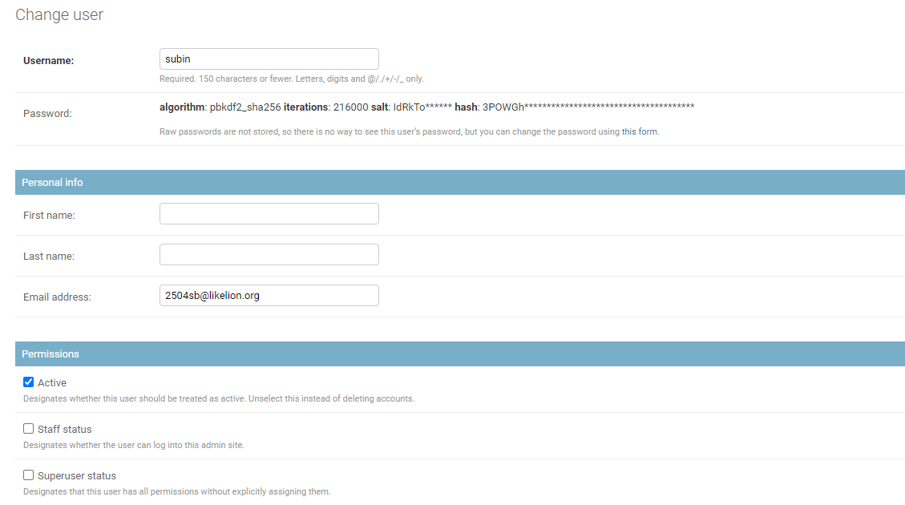

# Django login

### 📎강의자료
1. [Sign up](https://github.com/lee-sj/2020-django/blob/master/2020_08_27_sign_up.md)
2. [Login&out](https://github.com/lee-sj/2020-django/blob/master/2020_08_27_log_in_and_out.md)
3. [Auth](https://github.com/lee-sj/2020-django/blob/master/2020_08_27_auth.md)
4. [Google Mail 인증](https://github.com/lee-sj/2020-django/blob/master/2020_09_17_google_mail.md)

### Google Mail 인증 결과

 

> Google 계정은 보안을 위해 **로 바꿔서 업로드했습니다!