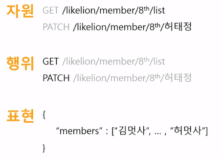

# 마스크 알리미 (MASK-NEARBY)

## 1. HTTP

### 1.1 Hyper Text Transfer Protocol

- Hyper Text : 참조를 통해 한 문서에서 관련된 다른 문서들로 넘나들며 원하는 정보를 얻을 수 있게 해주는 텍스트
- Transfer Protocol : 인터넷을 통해서 9정보를 주고 받을 때 지켜야하는 규칙

### 1.2 HTTP 구성

### 1.3 HTTP의 요청 메소드

- GET : URL에 표시된 리소스를 가져오기
- POST : body에 정보를 담아 서버에 입력
- PUT : URL에 표시된 리소스 변경
- PATCH : PUT과 다르게 일부만 수정
- DELETE : URL에 표시된 특정 리소스 삭제

## 2. JSON

### 2.1 Java Script Object Notation

- Key : Value 형식
- 데이터 교환에 주로 사용 (이전에는 XML이라는 형식을 사용했음)

### 2.2 JSON의 특징

- 기존 XML보다 가벼움
- 많은 프로그래밍 언어 지원
- 전송 시 : 직렬화 과정을 거침
- 수신 시 : 역직렬화 과정을 거침

## 3. API

### 3.1 Application Programming Interface

- Application : 우리가 사용하는 다양한 서비스들
- Programming Interface ; 서비스들이 제공해주는 데이터들에 접근하고 사용할 수 있도록 도와주는 도구

### 3.2 API의 종류

- SOAP : Simple Object Access Protocol
- **REST** : Representational State Transfer
- GraphQL : Graph Query Language

## 4.  REST

### 4.1 Representational State Transfer

- REST는 하나의 아키텍쳐

    (소프트웨어 아키텍쳐 : 소프트웨어를 설계하는 지침과 원칙)

- REST의 구성요소 : 자원, 행위, 표현

    

### 4.2 JSONPlaceholder

- Fake online REST API
- REST API를 테스트, 프로토타이핑 가능

### 4.3 URL의 구성

- 프로토콜 : http, https, file 등
- 호스트주소 : www.naver.com, www.goolgle.com
- 파일경로 : /home, /index.html
- Query parameter : `?id=1&postId=1` (검색, 필터링, 데이터 교환 시 사용)

### 4.4 POSTMAN

- API를 테스트하고 테스트 결과를 공유하는 플랫폼
- 주소 : https://www.postman.com/
